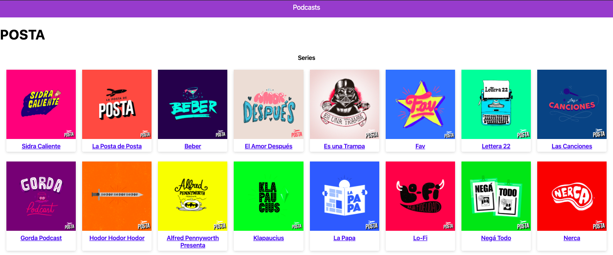

# App de Podcasts de Platzi

App de Podcasts integrada con la API de AudioBoom.

  

## ¿Cómo funciona?

- `npm install` para instalar las dependencias
- `npm run dev` para el entorno de desarrollo
- `npm run build && npm start` para el entorno de producción

## Licencia

MIT
